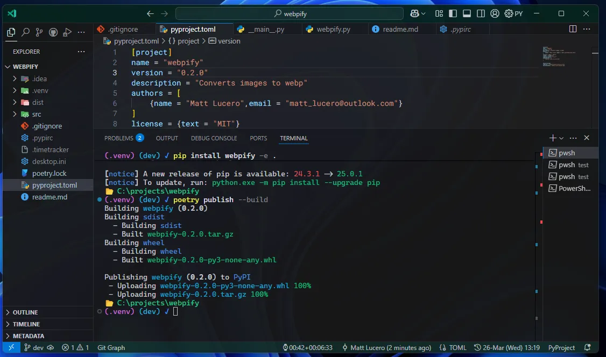

# Customized PowerShell Prompt

This repository contains a custom PowerShell prompt script designed to enhance your terminal experience, especially when working in Visual Studio Code (VSCode).

## Features

- **Dynamic Prompt**: Displays the current working directory, virtual environment (if active), and Git branch information.
- **Git Status**: Shows a checkmark (✓) for a clean Git status or a cross (✗) for uncommitted changes.
- **VSCode Detection**: Automatically adjusts the prompt for VSCode environments.

### **Prompt with Virtual Environment**:




### **Prompt in a Git Repository (.venv does not exist)**:
   


### **Default Prompt (Outside of VSCode Projects)**:
   


## Installation

1. Clone this repository or copy the `Microsoft.PowerShell_profile.ps1` script.
2. Place the script in your PowerShell profile directory. The default path is:
   ```plaintext
   $USER/Documents/PowerShell/Microsoft.PowerShell_profile.ps1
   ```
3. If the `$PROFILE` file does not exist, you can create it by running:
   ```powershell
   New-Item -ItemType File -Path $PROFILE -Force
   ```
4. Copy the contents of the script into the newly created `$PROFILE` file.
5. Restart your PowerShell terminal to apply the changes.

## Usage

- Open your PowerShell terminal.
- Navigate to a directory to see the enhanced prompt in action.
- If you're in a Git repository, the prompt will display the current branch and status.
- Activate a virtual environment to see its name reflected in the prompt.

## Learn More
I don't take all of the credit for this script. A lot of it I learned by visiting the [PowerShell documentation](https://learn.microsoft.com/en-us/windows/terminal/tutorials/custom-prompt-setup). 🙂

## Contributing

Feel free to open issues or submit pull requests to improve this script. Contributions are welcome!

## License

This project is licensed under the MIT License. See the `LICENSE` file for details.